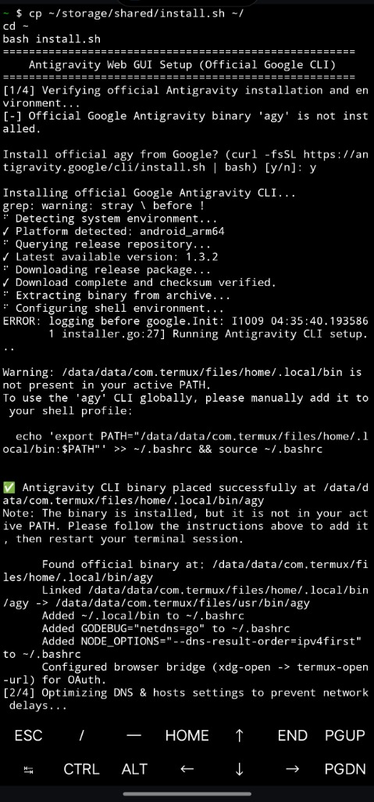
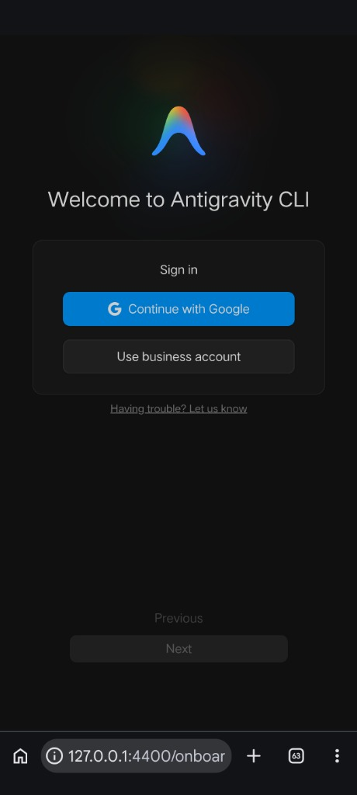
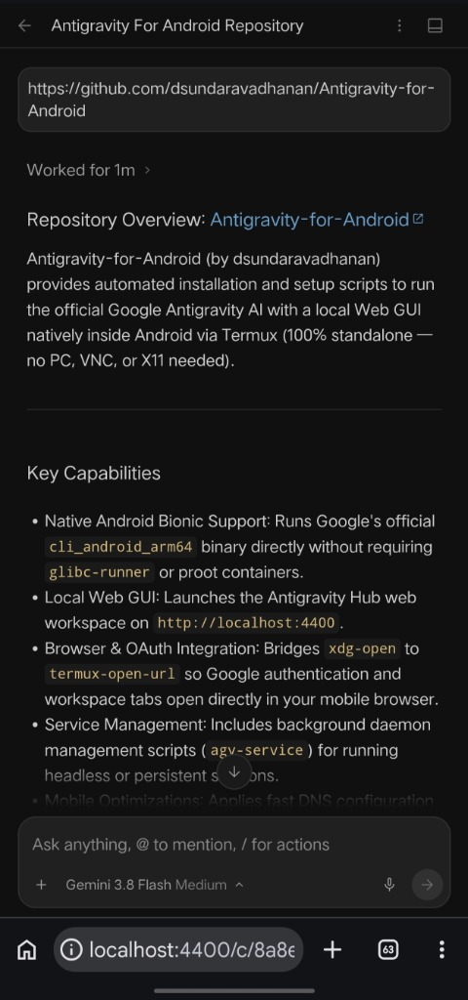
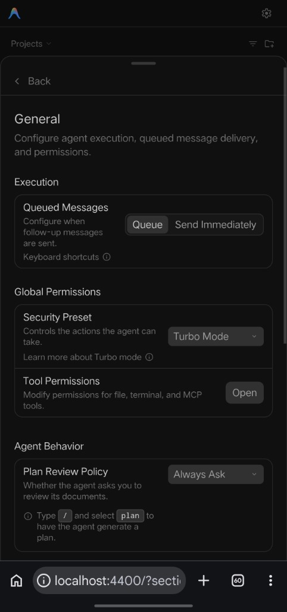

# Antigravity for Android: Local Web GUI via Termux

> Run Google Antigravity AI natively on Android with a full mobile Web GUI at `localhost:4400`. 100% standalone, no PC, VNC, or X11 required.

---

## Visual Showcase & Setup Walkthrough

| 1. Termux One-Line Installation | 2. Google OAuth Onboarding |
| :---: | :---: |
|  |  |

| 3. Mobile Web GUI Chat Workspace | 4. Agent Permissions & Turbo Mode |
| :---: | :---: |
|  |  |

---

## Credits & Upstream Projects

This project builds on official releases and open source contributions from the community:
- **Google Antigravity**: Official native Android Bionic release (`https://antigravity.google/cli/install.sh`).
- [@wallentx](https://github.com/wallentx): Maintains the automated release builds and packaging in [antigravity-cli-termux](https://github.com/wallentx/antigravity-cli-termux).
- [@hjotha](https://github.com/hjotha) and [@Brajesh2022](https://github.com/Brajesh2022): Developed the original compatibility fixes and memory patches that allow the Antigravity CLI to run inside Android Termux.

---

## Method 1: Quick Install

### Option A: Official Google Native Release (Recommended)

Run this command in Termux to install and configure everything automatically using Google's official native Android binary:

```bash
curl -fsSL https://raw.githubusercontent.com/dsundaravadhanan/Antigravity-for-Android/main/install.sh | bash
```

Or if running from a local folder:
```bash
bash install.sh
```

**What the automated installer does (for official Google binary):**
1. Requests Android storage access via `termux-setup-storage`.
2. Checks for Google's official `agy` binary. If not found, interactively offers to download and install it via `curl -fsSL https://antigravity.google/cli/install.sh | bash`.
3. Resolves Termux PATH warnings by linking `~/.local/bin/agy -> $PREFIX/bin/agy` and updating `~/.bashrc`.
4. Bridges `xdg-open` to `termux-open-url` so Google OAuth authentication tabs open automatically in your browser.
5. Adds fast DNS settings (`no-aaaa`) to prevent network startup delays.
6. Installs the `agy-gui` launcher and `agy-service` background manager.
7. **Zero glibc requirements** (runs natively on Android Bionic libc).

---

### Option B: Wallentx Community Release (Legacy glibc)

If you are using an older device or prefer the community repack build:

```bash
termux-setup-storage
pkg install glibc-repo glibc-runner python -y
curl -fsSL https://raw.githubusercontent.com/wallentx/antigravity-cli-termux/dev/install.sh | bash
curl -fsSL https://raw.githubusercontent.com/dsundaravadhanan/Antigravity-for-Android/main/patch_gui.sh | bash
```

---

### Running from Android Internal Storage

If you copied the install script to your phone's internal storage:
```bash
termux-setup-storage

# If copied to Downloads:
bash ~/storage/downloads/install.sh

# Or root of internal storage:
bash ~/storage/shared/install.sh
```

---

## Method 2: Two-Step Installation (CLI + GUI Patch)

If you prefer to separate the core upstream CLI installation from the Web GUI customizer:

### Option A: Official Google CLI (Recommended)
1. **Install upstream official Google CLI**:
   ```bash
   curl -fsSL https://antigravity.google/cli/install.sh | bash
   ```
2. **Apply Web GUI Setup**:
   ```bash
   curl -fsSL https://raw.githubusercontent.com/dsundaravadhanan/Antigravity-for-Android/main/install.sh | bash
   ```

### Option B: Wallentx Community CLI (Legacy glibc)
1. **Install core CLI engine** directly from [wallentx/antigravity-cli-termux](https://github.com/wallentx/antigravity-cli-termux):
   ```bash
   curl -fsSL https://raw.githubusercontent.com/wallentx/antigravity-cli-termux/dev/install.sh | bash
   ```
2. **Apply the legacy Web GUI Patch**:
   ```bash
   curl -fsSL https://raw.githubusercontent.com/dsundaravadhanan/Antigravity-for-Android/main/patch_gui.sh | bash
   ```
   Or if you have the script locally on your phone:
   ```bash
   bash patch_gui.sh
   ```

---

## Method 3: Manual Step-by-Step Installation

If you prefer to configure each component manually, choose your target engine below:

---

### Option A: Official Google Release (Native Bionic - Recommended)

Follow these steps to manually configure the Web GUI for the official Google Antigravity binary:

#### 1. Grant Storage Access
```bash
termux-setup-storage
```

#### 2. Install Official Google Antigravity CLI
Download and install the official native Android build:
```bash
curl -fsSL https://antigravity.google/cli/install.sh | bash
```

#### 3. Resolve PATH & Symlinks
Link the official binary into Termux's system path:
```bash
ln -sf "$HOME/.local/bin/agy" "$PREFIX/bin/agy"
grep -q '\.local/bin' "$HOME/.bashrc" 2>/dev/null || echo 'export PATH="$HOME/.local/bin:$PATH"' >> "$HOME/.bashrc"
```

#### 4. Configure Fast DNS Resolution
Restrict lookups to IPv4 to prevent mobile connection delays:
```bash
if [ -f "$PREFIX/etc/resolv.conf" ]; then
    grep -q "no-aaaa" "$PREFIX/etc/resolv.conf" || echo "options timeout:1 attempts:2 no-aaaa" >> "$PREFIX/etc/resolv.conf"
else
    mkdir -p "$PREFIX/etc"
    echo "nameserver 8.8.8.8" > "$PREFIX/etc/resolv.conf"
    echo "nameserver 1.1.1.1" >> "$PREFIX/etc/resolv.conf"
    echo "options timeout:1 attempts:2 no-aaaa" >> "$PREFIX/etc/resolv.conf"
fi
```

#### 5. Bridge Browser for Google OAuth
```bash
ln -sf "$PREFIX/bin/termux-open-url" "$PREFIX/bin/xdg-open"
```

#### 6. Create Foreground Launcher (`agy-gui`)
Create `$PREFIX/bin/agy-gui` to launch the server and auto-open your browser:
```bash
cat << 'EOF' > "$PREFIX/bin/agy-gui"
#!/data/data/com.termux/files/usr/bin/bash
PREFIX="${PREFIX:-/data/data/com.termux/files/usr}"
PORT=4400

for arg in "$@"; do
    case "$arg" in
        --hub-port=*) PORT="${arg#*=}" ;;
    esac
done

URL="http://localhost:${PORT}"

if curl -s -m 1 "http://127.0.0.1:${PORT}/" >/dev/null 2>&1; then
    echo "Antigravity GUI is already running on ${URL}"
    termux-open-url "${URL}" 2>/dev/null || termux-open "${URL}" 2>/dev/null || xdg-open "${URL}" 2>/dev/null
    exit 0
fi

AGY_BIN=""
if [ -x "$PREFIX/bin/agy" ]; then
    AGY_BIN="$PREFIX/bin/agy"
elif [ -x "$HOME/.local/bin/agy" ]; then
    AGY_BIN="$HOME/.local/bin/agy"
fi

if [ -z "$AGY_BIN" ]; then
    echo "[-] Error: Could not locate agy executable"
    exit 1
fi

export AGY_ENABLE_HUB=1

(
    for i in $(seq 1 30); do
        if curl -s -m 1 "http://127.0.0.1:${PORT}/" >/dev/null 2>&1; then
            termux-open-url "${URL}" 2>/dev/null || termux-open "${URL}" 2>/dev/null || xdg-open "${URL}" 2>/dev/null
            break
        fi
        sleep 0.5
    done
) &

exec "$AGY_BIN" --hub "$@"
EOF
chmod +x "$PREFIX/bin/agy-gui"
ln -sf "$PREFIX/bin/agy-gui" "$PREFIX/bin/agy-hub"
ln -sf "$PREFIX/bin/agy-gui" "$PREFIX/bin/agy-ui"
```

#### 7. Create Background Daemon Manager (`agy-service`)
Create `$PREFIX/bin/agy-service` to manage the GUI in the background:
```bash
cat << 'EOF' > "$PREFIX/bin/agy-service"
#!/data/data/com.termux/files/usr/bin/bash
PREFIX="${PREFIX:-/data/data/com.termux/files/usr}"
PID_FILE="$HOME/.gemini/antigravity-cli/hub.pid"
LOG_FILE="$HOME/.gemini/antigravity-cli/log/hub.log"
mkdir -p "$HOME/.gemini/antigravity-cli/log"

is_running() {
    [ -f "$PID_FILE" ] && ps -p "$(cat "$PID_FILE" 2>/dev/null)" >/dev/null 2>&1
}

case "$1" in
    start)
        if is_running; then
            echo "Antigravity Web GUI is already running (PID: $(cat "$PID_FILE"))."
            termux-open-url "http://localhost:4400" >/dev/null 2>&1 || true
            exit 0
        fi
        AGY_ENABLE_HUB=1 nohup "$PREFIX/bin/agy-gui" > "$LOG_FILE" 2>&1 &
        echo $! > "$PID_FILE"
        sleep 1.5
        echo "Started. URL: http://localhost:4400"
        termux-open-url "http://localhost:4400" >/dev/null 2>&1 || true
        ;;
    stop)
        if is_running; then
            kill $(cat "$PID_FILE") 2>/dev/null || true
            rm -f "$PID_FILE"
            echo "Antigravity Web GUI stopped."
        else
            echo "Antigravity Web GUI is not running."
        fi
        ;;
    status)
        if is_running; then
            echo "Antigravity Web GUI is running (PID: $(cat "$PID_FILE"))."
            echo "URL: http://localhost:4400"
        else
            echo "Antigravity Web GUI is stopped."
        fi
        ;;
    restart)
        "$0" stop
        sleep 1
        "$0" start
        ;;
    logs)
        [ -f "$LOG_FILE" ] && tail -n 50 -f "$LOG_FILE" || echo "No logs found."
        ;;
    *)
        echo "Usage: agy-service {start|stop|restart|status|logs}"
        exit 1
        ;;
esac
EOF
chmod +x "$PREFIX/bin/agy-service"
```

---

### Option B: Wallentx Community Release (Legacy glibc)

Follow these original steps for the community repack build:

#### 1. Grant Storage Access
```bash
termux-setup-storage
```

#### 2. Install Dependencies
Antigravity requires glibc packages and Python for the web logo patch:
```bash
pkg install glibc-repo -y
pkg install glibc-runner -y
pkg install python -y
```

#### 3. Install Antigravity CLI
Fetch and install the pre-patched binary from [wallentx/antigravity-cli-termux](https://github.com/wallentx/antigravity-cli-termux) (skipping interactive terminal launch):
```bash
export AGY_INSTALL_SKIP_LAUNCH=1
curl -fsSL https://raw.githubusercontent.com/wallentx/antigravity-cli-termux/dev/install.sh | bash
```

#### 4. Configure Fast DNS Resolution
```bash
if [ -f "$PREFIX/etc/resolv.conf" ]; then
    grep -q "no-aaaa" "$PREFIX/etc/resolv.conf" || echo "options timeout:1 attempts:2 no-aaaa" >> "$PREFIX/etc/resolv.conf"
else
    mkdir -p "$PREFIX/etc"
    echo "nameserver 8.8.8.8" > "$PREFIX/etc/resolv.conf"
    echo "nameserver 1.1.1.1" >> "$PREFIX/etc/resolv.conf"
    echo "options timeout:1 attempts:2 no-aaaa" >> "$PREFIX/etc/resolv.conf"
fi
```

#### 5. Create Foreground Launcher (`agy-gui`)
```bash
cat << 'EOF' > "$PREFIX/bin/agy-gui"
#!/data/data/com.termux/files/usr/bin/bash
PREFIX="${PREFIX:-/data/data/com.termux/files/usr}"
PORT=4400

for arg in "$@"; do
    case "$arg" in
        --hub-port=*) PORT="${arg#*=}" ;;
    esac
done

URL="http://localhost:${PORT}"

# 1. Ensure fast DNS
RESOLV_CONF="$PREFIX/etc/resolv.conf"
if [ -f "$RESOLV_CONF" ] && ! grep -q "no-aaaa" "$RESOLV_CONF" 2>/dev/null; then
    echo "options timeout:1 attempts:2 no-aaaa" >> "$RESOLV_CONF"
fi

# 2. Check if already running on target port
if curl -s -m 1 "http://127.0.0.1:${PORT}/" >/dev/null 2>&1; then
    echo "Antigravity GUI is already running on ${URL}"
    termux-open-url "${URL}" 2>/dev/null || termux-open "${URL}" 2>/dev/null || xdg-open "${URL}" 2>/dev/null
    exit 0
fi

# 3. Locate executable engine
AGY_BIN=""
if [ -x "$PREFIX/bin/agy.real" ]; then
    AGY_BIN="$PREFIX/bin/agy.real"
elif [ -x "$PREFIX/bin/agy.orig" ]; then
    AGY_BIN="$PREFIX/bin/agy.orig"
elif [ -x "$PREFIX/bin/agy" ]; then
    AGY_BIN="$PREFIX/bin/agy"
fi

if [ -z "$AGY_BIN" ]; then
    echo "[-] Error: Could not locate agy executable in $PREFIX/bin"
    exit 1
fi

# 4. Auto-verify and restore GUI patch if upstream replaced binary
if [ -x "$PREFIX/bin/agy-patch" ]; then
    "$PREFIX/bin/agy-patch" --silent >/dev/null 2>&1 || true
fi

export AGY_ENABLE_HUB=1

(
    for i in $(seq 1 30); do
        if curl -s -m 1 "http://127.0.0.1:${PORT}/" >/dev/null 2>&1; then
            termux-open-url "${URL}" 2>/dev/null || termux-open "${URL}" 2>/dev/null || xdg-open "${URL}" 2>/dev/null
            break
        fi
        sleep 0.5
    done
) &

exec "$AGY_BIN" --hub "$@"
EOF
chmod +x "$PREFIX/bin/agy-gui"
ln -sf "$PREFIX/bin/agy-gui" "$PREFIX/bin/agy-hub"
```

#### 6. Create Background Daemon Manager (`agy-service`)
```bash
cat << 'EOF' > "$PREFIX/bin/agy-service"
#!/data/data/com.termux/files/usr/bin/bash
PREFIX="${PREFIX:-/data/data/com.termux/files/usr}"
PID_FILE="$HOME/.gemini/antigravity-cli/hub.pid"
LOG_FILE="$HOME/.gemini/antigravity-cli/log/hub.log"
mkdir -p "$HOME/.gemini/antigravity-cli/log"

is_running() {
    [ -f "$PID_FILE" ] && ps -p "$(cat "$PID_FILE" 2>/dev/null)" >/dev/null 2>&1
}

case "$1" in
    start)
        if is_running; then
            echo "Antigravity Web GUI is already running (PID: $(cat "$PID_FILE"))."
            termux-open-url "http://localhost:4400" >/dev/null 2>&1 || true
            exit 0
        fi
        AGY_ENABLE_HUB=1 nohup "$PREFIX/bin/agy-gui" > "$LOG_FILE" 2>&1 &
        echo $! > "$PID_FILE"
        sleep 1.5
        echo "Started. URL: http://localhost:4400"
        termux-open-url "http://localhost:4400" >/dev/null 2>&1 || true
        ;;
    stop)
        if is_running; then
            kill $(cat "$PID_FILE") 2>/dev/null || true
            rm -f "$PID_FILE"
            echo "Antigravity Web GUI stopped."
        else
            echo "Antigravity Web GUI is not running."
        fi
        ;;
    logs)
        [ -f "$LOG_FILE" ] && tail -n 50 -f "$LOG_FILE" || echo "No logs found."
        ;;
    *)
        echo "Usage: agy-service {start|stop|logs}"
        ;;
esac
EOF
chmod +x "$PREFIX/bin/agy-service"
```

---

## Daily Usage

### Option A: Foreground Mode
Runs directly in your active Termux window. Press `Ctrl+C` to stop.
```bash
agy-gui
```

### Option B: Background Service Mode
Runs in the background, allowing you to minimize or close Termux while keeping the web workspace active in Chrome:
```bash
agy-service start   # Starts the server in background and opens Chrome
agy-service status  # Checks background server status
agy-service logs    # Views recent output for troubleshooting
agy-service stop    # Stops the background server
```

### Option C: Text CLI Mode
Use standard command-line mode without starting the web server:
```bash
agy
```

---

## Standalone Android App Experience

The Web GUI can be installed to your Android home screen via Chrome to provide a dedicated standalone app experience:

1. Start the server using `agy-gui` or `agy-service start`.
2. When the Web GUI opens in Chrome at `http://localhost:4400`, tap the **three dots menu (⋮)** in the top-right corner.
3. Select **Install app** (or **Add to Home screen**).
4. Tap **Install**.

The patched official Google Antigravity icon will be added to your Android home screen. Tapping it opens Antigravity in full-screen standalone app mode without browser toolbars or address bars.

---

## Authentication

The CLI authenticates with Google Account credentials:

- **Web GUI Sign-In**:
  1. On first launch, sign-in is prompted directly inside the Web GUI (`http://localhost:4400`).
  2. Tap **Sign In** to redirect to a new browser tab and complete Google authentication (automatically opened via `xdg-open` bridge).
  3. Once signed in, return to the `localhost:4400` tab and wait a few moments; the Antigravity workspace will open automatically.
- **Session Storage**: OAuth credentials are saved locally at `~/.gemini/antigravity-cli/antigravity-oauth-token` so subsequent launches remain signed in.
- **Sign Out**: Sign-out should be performed directly within the Web GUI interface via your account settings to clear active session credentials.
- **Privacy First**: All tokens are strictly stored inside `~/.gemini/antigravity-cli/` with secure permissions (`chmod 700` on directory, `chmod 600` on token). No outside storage or personal directories are scanned.

---

## Terms of Service, Security & Session Isolation

> [!WARNING]
> Autonomous AI coding agents carry inherent security risks, including autonomous command execution, prompt injection, and environment changes. Always monitor and verify actions taken by the agent.

By using Antigravity CLI, you agree to Google's product terms and data use policies:
- **Terms of Service**: [antigravity.google/terms](https://antigravity.google/terms)
- **Privacy Policy**: [policies.google.com/privacy](https://policies.google.com/privacy)

### Session Isolation (Web GUI vs. Termux CLI)
The Web GUI running on `localhost:4400` is completely separated from the Termux terminal CLI. All conversations, active tasks, and context inside the browser Web GUI are not visible, mirrored, or shared with the Termux terminal prompt, and vice versa. Each interface operates in its own isolated runtime session.

---

## How It Works

1. **100% Standalone on Android (No PC Required)**: Only your Android phone and an internet connection are needed. Unlike remote desktop streamers or relay proxies, the complete Antigravity CLI engine runs natively on your phone inside Termux, delivering the official Google Antigravity desktop Web GUI experience directly in your mobile browser.
2. **Embedded Web Assets**: The compiled engine binary contains Google's official React web bundle internally. When executed with `--hub`, it serves this full desktop interface locally over HTTP on port 4400.
3. **Automated Browser Launch**: The launcher polls `http://127.0.0.1:4400` until the local server is ready, then automatically opens your default Android browser directly into the workspace.
4. **Token Management**: Google OAuth tokens stored at `~/.gemini/antigravity-cli/antigravity-oauth-token` are automatically loaded on each launch for immediate authentication.

---

## Reverting / Uninstalling Web GUI

> [!WARNING]
> **Data Loss & Session Disclaimer**: Running `revert_gui.sh` forcibly terminates active web server processes and cleans local runtime state. All conversations and data inside `localhost:4400` will be permanently deleted. Back up any critical code, prompts, or chat outputs prior to running this script. The repository author and contributors accept no responsibility or legal liability for any data loss, lost conversations, or workflow disruptions caused by executing this uninstaller (see [DISCLAIMER.md](DISCLAIMER.md)).

To remove all Web GUI customizations, background daemon services, launchers, and network tweaks:

```bash
curl -fsSL https://raw.githubusercontent.com/dsundaravadhanan/Antigravity-for-Android/main/revert_gui.sh | bash
```

Or run locally:
```bash
bash revert_gui.sh
```

---

## Frequently Asked Questions (FAQ)

### How do I install Google Antigravity on Android via Termux?
Run the automated setup script in Termux:
```bash
curl -fsSL https://raw.githubusercontent.com/dsundaravadhanan/Antigravity-for-Android/main/install.sh | bash
```
The script requests Termux storage permissions, installs or links Google's official native ARM64 binary (`agy`), configures browser OAuth redirection (`xdg-open` -> `termux-open-url`), applies network latency optimizations, and installs both `agy-gui` and the `agy-service` daemon.

### Can Google Antigravity run on Android without a PC, root, or VNC?
Yes. Unlike remote desktop solutions, cloud relays, or heavy Linux PRoot containers, this setup runs Google's official native Android binary directly inside Termux on Android's native Bionic libc. No root access, VNC viewer, or X11 desktop environment is needed.

### How do I open and access the Antigravity Web GUI?
Start the server in Termux:
- **Foreground mode**: Run `agy-gui`.
- **Background mode**: Run `agy-service start` (allows minimizing or closing Termux while keeping the server alive).
The launcher automatically opens your Android browser at `http://localhost:4400`.

### How do I make the Antigravity Web GUI faster and smoother in Chrome?
1. **Hardware-Accelerate Mobile Chrome (GPU Rasterization)**:
   - In Chrome, open `chrome://flags`.
   - Search for and enable:
     - **GPU Rasterization** (`#enable-gpu-rasterization`) ➔ Set to **Enabled**
     - **Override software rendering list** (`#ignore-gpu-blocklist`) ➔ Set to **Enabled**
   - Tap **Relaunch** at the bottom of Chrome.
2. **Install as a Standalone PWA**:
   - Open `http://localhost:4400` in Chrome.
   - Tap Chrome's three-dot menu (**⋮**) ➔ **Install app** (or **Add to Home screen**).
   - Runs full-screen with dedicated GPU rendering and no browser URL bar overhead.
3. **Go Memory Optimization**:
   - `install.sh` automatically configures `export GOMEMLIMIT=1536MiB` in `~/.bashrc` to prevent GC thrashing and Android Low Memory Killer (LMK) process drops.

### How do I install Antigravity as a standalone Android app?
When `http://localhost:4400` is open in Chrome:
1. Tap the three-dot menu (**⋮**) in the top-right corner.
2. Tap **Install app** (or **Add to Home screen**).
3. Confirm **Install**.
The official Google Antigravity app icon is placed on your home screen and launches in full-screen standalone mode without URL bars.

### How does Google authentication work?
On first launch, Antigravity displays an onboarding screen at `http://localhost:4400/onboard`. Tap **Continue with Google**, and the browser bridge automatically opens an OAuth sign-in tab. Once completed, tokens are stored securely in `~/.gemini/antigravity-cli/antigravity-oauth-token` (`chmod 600`).

---

## Troubleshooting Common Errors

### 1. `bash: agy: command not found`
**Cause**: The binary directory is not in your active Termux environment `$PATH`.  
**Fix**: Ensure your shell profile includes `~/.local/bin` and `$PREFIX/bin`:
```bash
echo 'export PATH="$HOME/.local/bin:$PREFIX/bin:$PATH"' >> ~/.bashrc
source ~/.bashrc
```

### 2. `This site can't be reached` / `ERR_CONNECTION_REFUSED` on `localhost:4400`
**Cause**: The Antigravity Web GUI server is not running or crashed during background initialization.  
**Fix**: Check status and logs:
```bash
agy-service status  # Check if PID is alive
agy-service logs    # Check recent crash or launch logs
agy-service start   # Restart server in background
```
Also verify that `localhost` is mapped correctly in Termux:
```bash
cat << 'EOF' > $PREFIX/etc/hosts
127.0.0.1 localhost
::1 localhost ip6-localhost
EOF
```

### 3. Termux Process Killed / App Suspends When Minimized
**Cause**: Android battery optimization or Android 12+ Phantom Process Killer terminating background services.  
**Fix**:
1. Run `termux-wake-lock` inside Termux to acquire a CPU wake lock.
2. In Android Settings -> **Apps** -> **Termux** -> **Battery**, select **Unrestricted** (turn off battery optimization).
3. If using Samsung (One UI), Xiaomi (MIUI/HyperOS), or OnePlus (OxygenOS), lock Termux in recent apps so it is not cleared from RAM.

### 4. OAuth Browser Tab Does Not Open During Sign-In
**Cause**: Missing or broken browser bridge (`xdg-open`).  
**Fix**: Re-link `xdg-open` to `termux-open-url`:
```bash
ln -sf $(which termux-open-url) $PREFIX/bin/xdg-open
chmod +x $PREFIX/bin/xdg-open
```
Test by running: `xdg-open https://google.com` (should open your default Android browser).

### 5. Slow Startup or Network Timeout on Mobile Data (IPv6 Delay)
**Cause**: Mobile carriers often fail or delay IPv6 AAAA DNS lookups.  
**Fix**: Configure Termux resolver to prioritize IPv4:
```bash
echo "options timeout:1 attempts:2 no-aaaa" >> $PREFIX/etc/resolv.conf
echo 'export NODE_OPTIONS="--dns-result-order=ipv4first"' >> ~/.bashrc
source ~/.bashrc
```

### 6. Interactive Prompt Options / Clarifying Question Buttons Unresponsive
**Cause**: Mobile Chrome translates taps into touch gestures (`touchstart`/`touchend`) rather than desktop mouse clicks (`onClick`/`pointerup`), or soft keyboard viewport zoom displaces clickable coordinates.  
**Fix**:
1. **Enable Desktop Site**: Tap Chrome's three-dot menu (**⋮**) and check **Desktop site**. This restores standard desktop click handling.
2. **Dismiss the Virtual Keyboard**: Close your phone's soft keyboard before tapping options so viewport scaling does not misalign the touch target.
3. **Type Your Answer as Fallback**: If a touch tap is not captured, type the option number or text response directly into the chat prompt box and press Send.
4. **Pull-to-Refresh**: Refresh the browser tab (`pull-to-refresh` or `Ctrl+R`) to re-sync any stale WebSocket connection.

### 7. "Lost connection to the language server. Agent features may not work"
**Cause**: Android suspending or killing Termux child processes (Language Server/LSP) when switching to Chrome, or loopback heartbeat timeouts.  
**Fix**:
- `install.sh` automatically calls `termux-wake-lock` to keep background services active.
- Ensure Termux battery optimization is set to **Unrestricted** in Android App Settings.
- Verify `$PREFIX/etc/hosts` contains `::1 localhost ip6-localhost` (automatically configured by `install.sh`).

### 8. "There was an unexpected issue setting up your account: Failed to fetch"
**Cause**: Accessing the Web GUI via `http://127.0.0.1:4400` instead of `http://localhost:4400`, or setting `GODEBUG="netdns=go"` which breaks external Android DNS.  
**Fix**: Always access the Web GUI using `http://localhost:4400` so Google's Cloud OAuth whitelist permits authentication, and ensure `GODEBUG` is unset so Android's native `netd` daemon resolves `accounts.google.com`.

---

### Need Help or Found a Bug?
If you encounter any unexpected issues, bugs, or have questions, please report them on the [GitHub Issues](https://github.com/dsundaravadhanan/Antigravity-for-Android/issues) page.

---

## License & Legal Disclaimers

- **License**: Distributed under the [Apache License 2.0](LICENSE.md).
- **Disclaimer**: See [DISCLAIMER.md](DISCLAIMER.md) for limitation of liability and non-affiliation notices.
